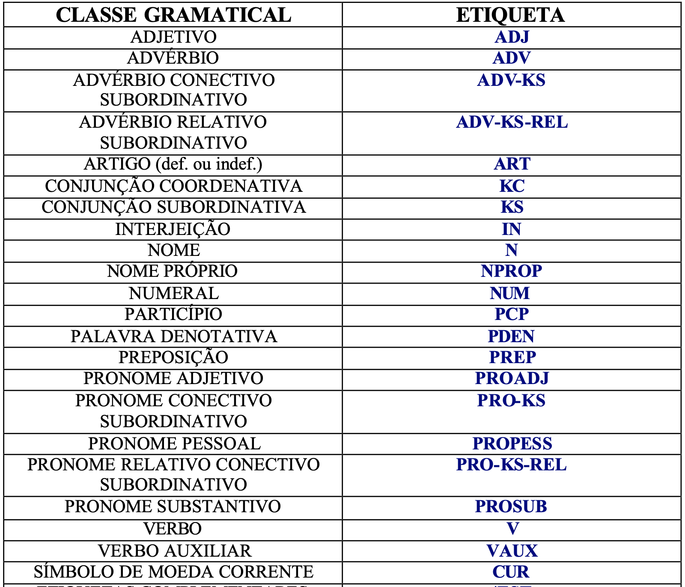

# Singularity-POS-Tagger
Portuguese POS-Tagger writen in core Node.JS, without any external modules. 

I developed this library to use as base for another personal project. There are planing of room to improve accuracy with heuristics and twiks.

It's designed specially for Node.Js Streams, which can improve speed and memory use when working on servers or large corpus of data. Nonethless, one can still use a built in method to work with strings.

There is no need to pre-processing the corpus, there is a built in function that cleans everything before the POS classification.

Because the nature of JavaScript be single threaded and NLP jobs are usually very resource intense, almost everything in this package runs asyncronous.

# Installation 
In a Node.JS environment you can run on your terminal. 
>npm i singularity-tagger

# What is a POS Tagger?

A POS Tagger or Part of Speach Tagger is a piece of software that analyzes a corpus and taggs the words with it's respective gramatical class. 

# Applications of POS Taggers
  - Sentiment analysis
  - Question answering
  - Word sense disambiguation
  
Basically every Natural Language Processing task uses a POS tagger as sub task.

# Implementation 
- Model trained on Mac-Morpho's anotated corpus available on: http://nilc.icmc.usp.br/macmorpho/
- Stochastic algorithm used: 
  * Hidden Markov Model (HMM) with Viterbi Algorithm
  

- Algorithm implemented based on Stanford's document available on: https://web.stanford.edu/~jurafsky/slp3/8.pdf
  
# How to use
*__Singularity__* is designed to be used on async functions or as ECMS6 promise.
There are two main methods available:
- __analyzeString__
    * receive as parameter one string and returns an array with normalized words
    along side the tags of the string
- __analyzeStream__
    * receive as parameter an input stream and output stream and returns to the output stream the normalized text along side the tags
## Code example
- __Inside Asyncronous functions__:
    * analyzeString:
      * > const PosTagger = require("singularity-tagger") 
        >
        >...
        >
        > const tagger = await PosTagger()
        >
        > const taggedArray = await tagger.analyzeString(string)
        >
        > console.log(await taggedArray)
    * analyzeStream:
      * > const PosTagger = require("singularity-tagger") 
        >
        >...
        >
        > const tagger = await PosTagger()
        >
        > await tagger.analyzeStream(process.stdin, process.stdout) // can be any stream interface
- __Inside Syncronous functions__:
    * analyzeString:
      * > const PosTagger = require("singularity-tagger") 
        >
        >...
        >
        > PosTagger().then((tagger)=> tagger.analyzeString(string)).then(resp=> console.log()).catch(err=>console.log(err))
    * analyzeStream:
      * > const PosTagger = require("singularity-tagger") 
        >
        >...
        >
        > PosTagger().then((tagger)=> tagger.analyzeStream(inputStream, outputStream)).catch(err=>console.log(err))
  
# Tags meaning table

